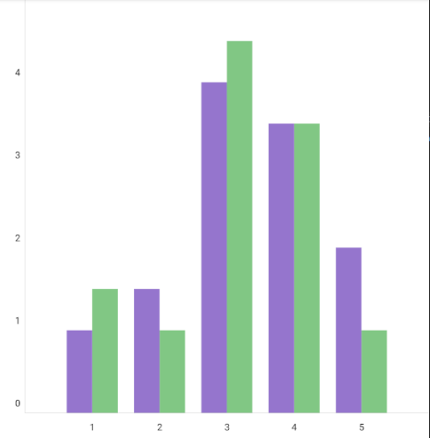

# Compose chart

Flexible and simple library for creating charts using Jetpack Compose.

### Disclaimer: this is not production ready code. I've created this lib to explore some custom drawing options of Jetpack Compose

## Features

* Multiple chart types supported out of the box:
    * Bar chart (also with grouping bars)
    * Line chart
    * Points chart
    * Combinations of all the above
* Zooming and panning
* Customisation flexibility:
    * Adjustable drawing of axis, labels, chart's data
    * Customisable grids
    * Possibility to provide own renderers for chart's elements

Creating a chart is as easy as adding the code below:

```kotlin
@Composable
fun BarChartScreen() {
    Chart(
        modifier = Modifier.aspectRatio(1f, false),
        // Set the initial chart viewport.
        viewport = Viewport(0f, 6f, 0f, 5f)
    ) {
        // Define the data to display.
        series(
            seriesOf(
                "Data I",
                pointOf(1f, 1f),
                pointOf(2f, 1.5f),
                pointOf(3f, 4f),
                pointOf(4f, 3.5f),
                pointOf(5f, 2f)
            ),
            seriesOf(
                "Data II",
                pointOf(1f, 1.5f),
                pointOf(2f, 1f),
                pointOf(3f, 4.5f),
                pointOf(4f, 3.5f),
                pointOf(5f, 1f)
            ),

            // Set the renderer.
            renderer = barRenderer(
                brushProvider = {
                    SolidColor(
                        when (it) {
                            "Data I" -> Color.DeepPurple
                            "Data II" -> Color.Green
                            else -> Color.Pink
                        }
                    )
                },
                preferredWidth = 64f,
            )
        )

        // Enable rendering axis and labels.
        horizontalAxis(horizontalAxisRenderer())

        horizontalLabel(horizontalLabelRenderer())

        verticalAxis(verticalAxisRenderer())

        verticalLabel(verticalLabelRenderer())
    }
}
```



For more examples check out [the samples](samples/src/main/java/io/github/staakk/cchart/samples).
