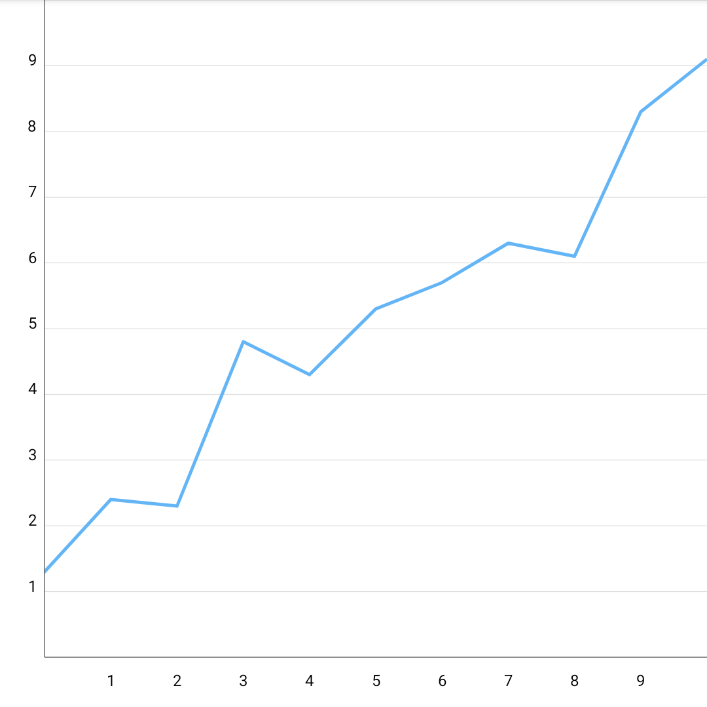
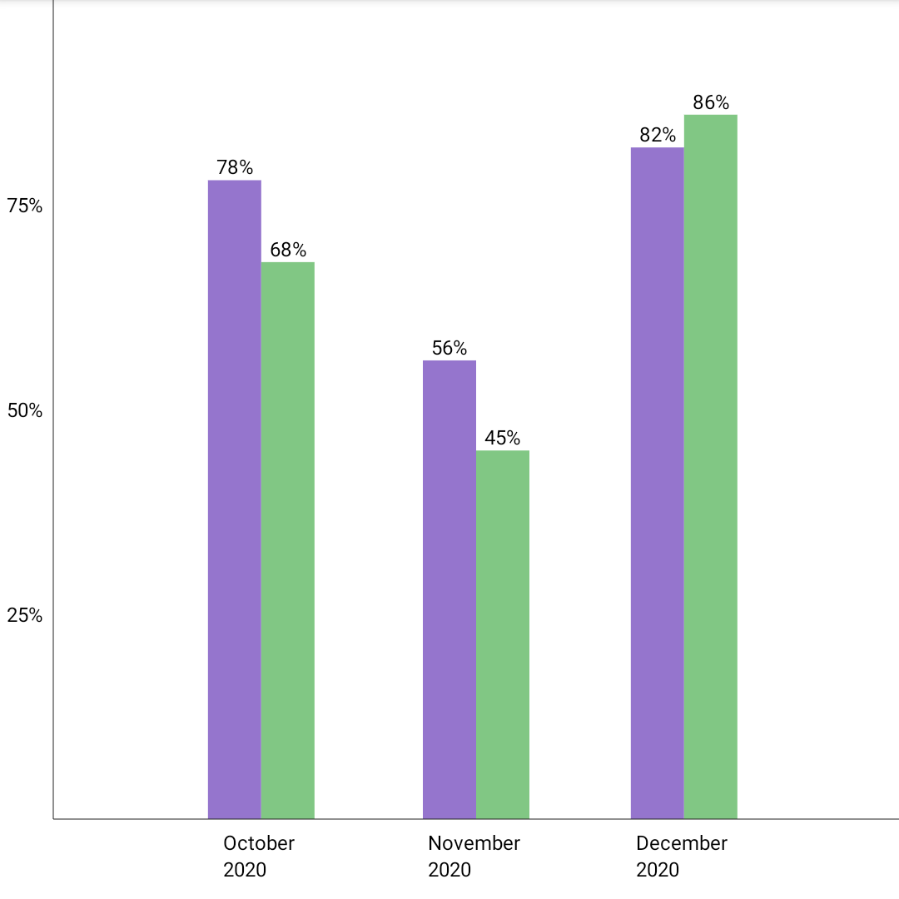
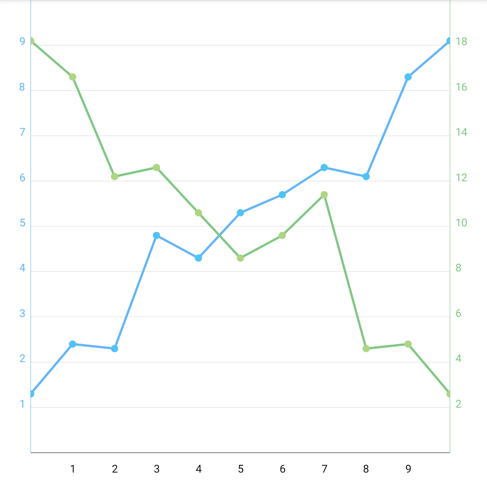

# Compose chart

Flexible and simple library for creating charts using Jetpack Compose.

### Disclaimer: this is not production ready code. I've created this lib to explore some custom drawing options of Jetpack Compose

## Features

* Multiple chart types supported out of the box:
    * Bar chart (also with grouping bars)
    * Line chart
    * Points chart
    * Combinations of all the above
* Zooming and panning
* Customisation flexibility:
    * Adjustable drawing of axis, labels, chart's data
    * Customisable grids
    * Possibility to provide own renderers for chart's elements
* Adding labels for data on chart

Here are few examples together with the code:


<details>
<summary>
<b>Click to view the code.</b>
</summary>

```kotlin
Chart(
    modifier = Modifier
        .aspectRatio(1f, false)
        .padding(bottom = 16.dp),
    viewport = Viewport(0f, 10f, 0f, 10f)
) {
    series(
        seriesOf(
            "data",
            pointOf(0f, 1.3f),
            pointOf(1f, 2.4f),
            pointOf(2f, 2.3f),
            pointOf(3f, 4.8f),
            pointOf(4f, 4.3f),
            pointOf(5f, 5.3f),
            pointOf(6f, 5.7f),
            pointOf(7f, 6.3f),
            pointOf(8f, 6.1f),
            pointOf(9f, 8.3f),
            pointOf(10f, 9.1f),
        ),
        renderer = lineRenderer(brush = SolidColor(Blue))
    )

    verticalAxis(verticalAxisRenderer(
        brush = SolidColor(DarkGrey)
    ))

    horizontalAxis(horizontalAxisRenderer(
        brush = SolidColor(DarkGrey)
    ))

    verticalAxisLabels(verticalLabelRenderer())

    horizontalAxisLabels(horizontalLabelRenderer())

    grid(gridRenderer(
        brush = SolidColor(LightGrey),
        orientation = GridOrientation.HORIZONTAL
    ))
}
```
</details>


<details>
<summary>
<b>Click to view the code.</b>
</summary>

```kotlin
Chart(
    modifier = Modifier.aspectRatio(1f, false)
        .padding(bottom = 16.dp),
    viewport = Viewport(
        minX = LocalDate.of(2020, 9, 1).toEpochDay(),
        maxX = LocalDate.of(2021, 1, 1).toEpochDay(),
        minY = 0f,
        maxY = 100f
    )
) {
    val series1 = "series_1"
    val series2 = "series_2"
    series(
        seriesOf(
            series1,
            pointOf(LocalDate.of(2020, 10, 1).toEpochDay(), 78f),
            pointOf(LocalDate.of(2020, 11, 1).toEpochDay(), 56f),
            pointOf(LocalDate.of(2020, 12, 1).toEpochDay(), 82f),
        ),
        seriesOf(
            series2,
            pointOf(LocalDate.of(2020, 10, 1).toEpochDay(), 68f),
            pointOf(LocalDate.of(2020, 11, 1).toEpochDay(), 45f),
            pointOf(LocalDate.of(2020, 12, 1).toEpochDay(), 86f),
        ),
        renderer = barRenderer(
            brushProvider = {
                SolidColor(
                    when (it) {
                        series1 -> DeepPurple
                        series2 -> Green
                        else -> Pink
                    }
                )
            },
            preferredWidth = 64f,
        )
    )

    verticalAxis(verticalAxisRenderer(
        brush = SolidColor(DarkGrey)
    ))

    horizontalAxis(horizontalAxisRenderer(
        brush = SolidColor(DarkGrey)
    ))

    dataLabels(HorizontalAlignment.CENTER, VerticalAlignment.TOP) {
        Text(
            text = "${point.y.toInt()}%",
            style = TextStyle(fontSize = 12.sp)
        )
    }

    verticalAxisLabels(verticalLabelRenderer(
        labelsProvider = object : LabelsProvider {
            override fun provide(min: Float, max: Float): List<Pair<String, Float>> =
                (min.toInt()..max.toInt())
                    .filter { it % 25 == 0}
                    .map { "$it%" to it.toFloat() }

            override fun getMaxLength(): Int = 3

            override fun getMaxLines(): Int = 1

        }
    ))

    horizontalAxisLabels(horizontalLabelRenderer(
        labelsProvider = object : LabelsProvider {
            private val pattern = "MMMM \nyyyy"
            private val formatter = DateTimeFormatter.ofPattern(pattern)

            override fun provide(min: Float, max: Float): List<Pair<String, Float>> {
                var currentDate = LocalDate.ofEpochDay(min.toLong()).withDayOfMonth(1)
                val endDate = LocalDate.ofEpochDay(max.toLong()).withDayOfMonth(1)

                val labels = mutableListOf<Pair<String, Float>>()
                while (currentDate.isBefore(endDate)) {
                    labels.add(currentDate.format(formatter) to currentDate.toEpochDay().toFloat())
                    currentDate = currentDate.plusMonths(1)
                }
                return labels
            }

            override fun getMaxLength(): Int = pattern.length

            override fun getMaxLines(): Int = 2
        }
    ))
}
```
</details>


<details>
<summary>
<b>Click to view the code.</b>
</summary>

```kotlin
Chart(
    modifier = Modifier
        .aspectRatio(1f, false)
        .padding(bottom = 16.dp),
    viewport = Viewport(0f, 10f, 0f, 10f)
) {
    series(
        seriesOf(
            "Data",
            pointOf(0f, 1.3f),
            pointOf(1f, 2.4f),
            pointOf(2f, 2.3f),
            pointOf(3f, 4.8f),
            pointOf(4f, 4.3f),
            pointOf(5f, 5.3f),
            pointOf(6f, 5.7f),
            pointOf(7f, 6.3f),
            pointOf(8f, 6.1f),
            pointOf(9f, 8.3f),
            pointOf(10f, 9.1f),
        ),
        renderer = combine(
            lineRenderer(brush = SolidColor(Blue)),
            pointRenderer(
                brush = SolidColor(LightBlue),
                radius = with(LocalDensity.current) { 4.dp.toPx() }
            )
        )
    )

    series(
        seriesOf(
            "Data1",
            pointOf(0f, 9.1f),
            pointOf(1f, 8.3f),
            pointOf(2f, 6.1f),
            pointOf(3f, 6.3f),
            pointOf(4f, 5.3f),
            pointOf(5f, 4.3f),
            pointOf(6f, 4.8f),
            pointOf(7f, 5.7f),
            pointOf(8f, 2.3f),
            pointOf(9f, 2.4f),
            pointOf(10f, 1.3f),
        ),
        renderer = combine(
            lineRenderer(brush = SolidColor(Green)),
            pointRenderer(
                brush = SolidColor(LightGreen),
                radius = with(LocalDensity.current) { 4.dp.toPx() }
            )
        )
    )

    verticalAxis(verticalAxisRenderer(
        brush = SolidColor(Blue),
        location = VerticalAxisLocation.LEFT
    ))

    verticalAxis(verticalAxisRenderer(
        brush = SolidColor(Green),
        location = VerticalAxisLocation.RIGHT
    ))

    horizontalAxis(horizontalAxisRenderer(
        brush = SolidColor(DarkGrey)
    ))

    verticalAxisLabels(verticalLabelRenderer(
        paint = Paint().apply {
            color = Blue.toArgb()
            typeface = Typeface.DEFAULT
            textSize = with(LocalDensity.current) { 12.sp.toPx() }
            isAntiAlias = true
        },
        location = VerticalLabelLocation.LEFT,
        side = VerticalLabelSide.LEFT
    ))

    verticalAxisLabels(verticalLabelRenderer(
        paint = Paint().apply {
            color = Green.toArgb()
            typeface = Typeface.DEFAULT
            textSize = with(LocalDensity.current) { 12.sp.toPx() }
            isAntiAlias = true
        },
        location = VerticalLabelLocation.RIGHT,
        side = VerticalLabelSide.RIGHT,
        labelsProvider = object: LabelsProvider {
            override fun provide(min: Float, max: Float): List<Pair<String, Float>> {
                return (min.toInt()..(max.toInt() + 1)).map { "${it * 2}" to it.toFloat() }
            }

            override fun getMaxLength(): Int = 4

            override fun getMaxLines(): Int = 1
        }
    ))

    horizontalAxisLabels(horizontalLabelRenderer())

    grid(gridRenderer(
        brush = SolidColor(LightGrey),
        orientation = GridOrientation.HORIZONTAL
    ))
}
```
</details>

For more examples check out [the samples](samples/src/main/java/io/github/staakk/cchart/samples).
